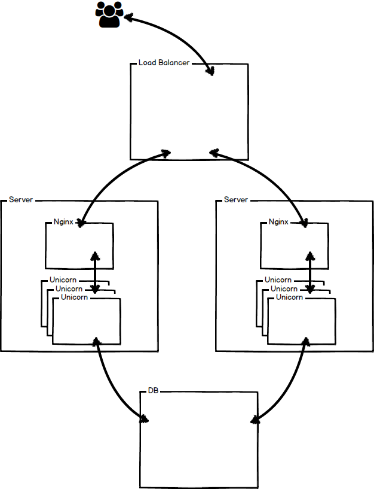

# Kubernetes-Rails

**NOTE** This is not production ready. The env is set to "production" as a proof of concept to show the asset pipeline is working in prod.

## Run locally
1. `docker-machine create --driver virtualbox --virtualbox-disk-size "30000"  --virtualbox-memory "8096" kubernetes-rails`
2. `docker-machine start kubernetes-rails`
3. `eval "$(docker-machine env kubernetes-rails)"`
4. `docker-compose build && docker-compose up -d`

## Build images
You will need to change **foxio-rnd** to your GCE project name.

1. `docker build -t gcr.io/foxio-rnd/rails-image:v1 web/.`
2. `gcloud docker push gcr.io/foxio-rnd/rails-image:v1` **Note** pushing can take a long time and use a lot of bandwidth. This actually times out sometimes. Just run it again if it does that.
3. `docker build -t gcr.io/foxio-rnd/nginx-image:v1 nginx/.`
4. `gcloud docker push gcr.io/foxio-rnd/nginx-image:v1`

## GCE deploy
1. `gcloud container clusters create kubernetes-rails --num-nodes 2 --machine-type g1-small`
2. `kubectl run db --image=postgres --port=5432`
3. `kubectl expose rc db`
4. Update kubernetes/web-controller.yaml to use your GCE project name instead of **foxio-rnd**
5. `kubectl create -f kubernetes/web-controller.yaml`
6. Using `kubectl get pods` wait for the 2 pods to change to `Running`. This can take a few minutes.
7. `kubectl create -f kubernetes/web-service.json`

## DB Setup
1. `kubectl get pods`
2. `kubectl exec -it [pod id] -c web bash`
3. run `rake db:create` and `rake db:migrate`

## Teardown
1. `gcloud container clusters delete kubernetes-rails`
2. Manually delete the Load balancer from the Network -> Network load balancer

## TODO
1. automate the DB setup
2. setup DB cluster
